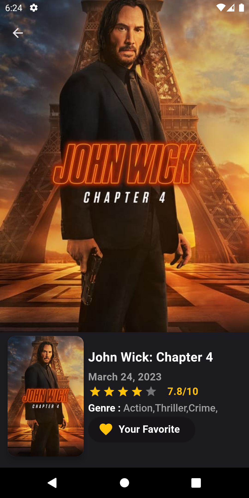

# MovieDB Flutter App  
Welcome to MovieDB, a Flutter app that allows you to explore and discover movies and TV shows. This app was built using the BLoC state management pattern, providing a seamless and efficient user experience. All the data is fetched using The Movie Database (TMDb) API, which you can explore further [here](https://developer.themoviedb.org/).

## Features

- Browse a vast collection of movies and TV shows.
- View detailed information about each title, including synopsis, cast, and ratings.
- Search for specific movies or shows using keywords.
- Save your favorite titles to your watchlist.
- Stay up-to-date with the latest releases and trending movies.

## Screenshots

  
  

 

  
  

 

  
  

 

  
  

